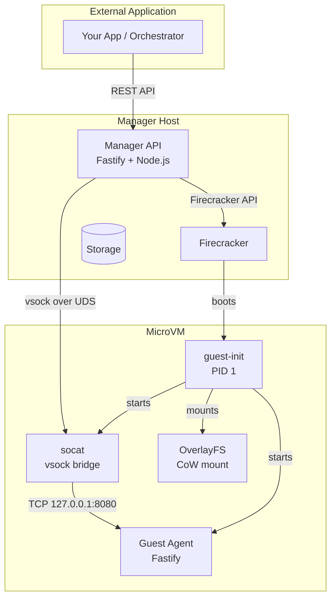
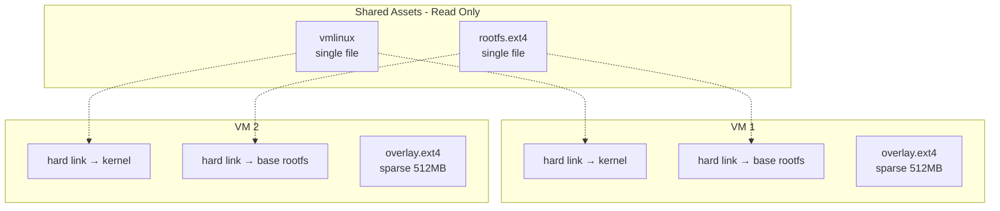
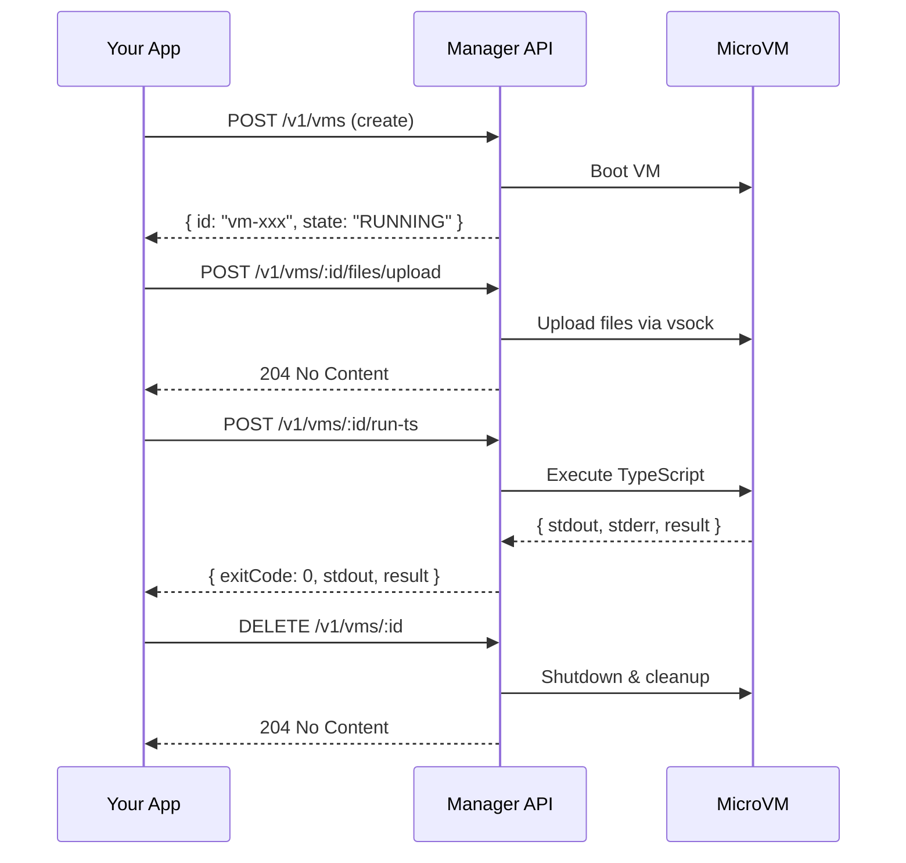

# Architecture & Storage

This page explains the internal architecture of run-dat-sheesh, including the OverlayFS-based copy-on-write storage system that enables fast VM provisioning and efficient disk usage.

## High-Level Architecture



## Communication Flow

### 1. External App → Manager API

Your application communicates with the Manager via REST API:

```bash
# Create a VM
curl -X POST http://localhost:3000/v1/vms \
  -H "X-API-Key: $API_KEY" \
  -H "Content-Type: application/json" \
  -d '{"cpu": 1, "memMb": 256, "allowIps": [], "outboundInternet": true}'

# Execute code
curl -X POST http://localhost:3000/v1/vms/$VM_ID/exec \
  -H "X-API-Key: $API_KEY" \
  -H "Content-Type: application/json" \
  -d '{"cmd": "echo hello"}'
```

### 2. Manager → Firecracker

The Manager uses Firecracker's HTTP API (over Unix socket) to:
- Configure VM resources (CPU, memory, drives)
- Start/stop/pause VMs
- Manage snapshots

### 3. Manager → Guest Agent (vsock)

The Manager communicates with the Guest Agent over vsock (virtual socket):
- `socat` inside the VM bridges vsock port 8080 to TCP `127.0.0.1:8080`
- The Guest Agent handles exec, run-ts, run-js, and file operations
- This provides secure, low-latency host-to-guest communication without networking

---

## OverlayFS Copy-on-Write Storage

### The Problem (Traditional Approach)

Without OverlayFS, each VM requires a full copy of the root filesystem:

```
Base Rootfs (~300-500MB) → cp → VM Rootfs Copy
Kernel (~30MB) ─────────→ cp → VM Kernel Copy
```

This causes:
- **Slow VM creation**: Copying hundreds of MBs takes 1-5 seconds
- **Disk waste**: Each VM uses ~500MB even if it writes nothing

### The Solution (OverlayFS)

With OverlayFS enabled (default), VMs share a read-only base image and only store their changes:



### How It Works

1. **VM Creation**:
   - Hard link the kernel (instant, O(1))
   - Hard link the base rootfs (instant, O(1))
   - Create a sparse ext4 overlay disk (instant, starts at 0 actual bytes)

2. **Guest Boot** (inside the VM):
   - Mount `/dev/vda` (base rootfs) as read-only at `/mnt/lower`
   - Mount `/dev/vdb` (overlay disk) at `/mnt/overlay`
   - Create OverlayFS: `lowerdir=/mnt/lower`, `upperdir=/mnt/overlay/upper`
   - `pivot_root` to the merged filesystem

3. **At Runtime**:
   - Reads come from the base image (shared across all VMs)
   - Writes go to the overlay disk (per-VM, sparse)
   - The guest sees a normal, fully writable filesystem

### Benefits

| Metric | Without OverlayFS | With OverlayFS |
|--------|------------------|----------------|
| VM Creation Time | 1-5 seconds | ~50-100ms |
| Disk per VM (idle) | ~300-500MB | ~1-5MB |
| Base Image Sharing | None | 100% shared |

### Configuration

OverlayFS is **enabled by default**. Configure via environment variables:

| Variable | Default | Description |
|----------|---------|-------------|
| `ENABLE_OVERLAY` | `true` | Enable/disable OverlayFS mode |
| `OVERLAY_SIZE_BYTES` | `536870912` (512MB) | Max size of per-VM overlay disk (sparse file) |

To disable OverlayFS and use traditional full-copy mode:

```bash
ENABLE_OVERLAY=false
```

---

## Orchestrating VMs from External Applications

### Basic Workflow



### Example: SDK Upload Pattern

A common pattern is uploading an SDK to the VM, then running code that imports it:

```typescript
// 1. Create the VM
const vm = await fetch("http://manager:3000/v1/vms", {
  method: "POST",
  headers: { "X-API-Key": API_KEY, "Content-Type": "application/json" },
  body: JSON.stringify({ cpu: 1, memMb: 256, allowIps: [], outboundInternet: true })
}).then(r => r.json());

// 2. Upload your SDK as tar.gz
const sdkTarGz = await createTarGz("./my-sdk");
await fetch(`http://manager:3000/v1/vms/${vm.id}/files/upload?dest=%2Fworkspace%2Fsdk`, {
  method: "POST",
  headers: { "X-API-Key": API_KEY, "Content-Type": "application/gzip" },
  body: sdkTarGz
});

// 3. Run code that uses the SDK
const result = await fetch(`http://manager:3000/v1/vms/${vm.id}/run-ts`, {
  method: "POST",
  headers: { "X-API-Key": API_KEY, "Content-Type": "application/json" },
  body: JSON.stringify({
    code: `
      import { myFunction } from "/workspace/sdk/index.ts";
      const data = await myFunction();
      result.set(data);
    `
  })
}).then(r => r.json());

console.log(result.result); // Your SDK's output

// 4. Cleanup
await fetch(`http://manager:3000/v1/vms/${vm.id}`, {
  method: "DELETE",
  headers: { "X-API-Key": API_KEY }
});
```

### Snapshots for Fast Cloning

If you need to run many jobs with the same SDK pre-installed:

```typescript
// 1. Create a "template" VM and install your SDK
const templateVm = await createVm({ cpu: 1, memMb: 256, allowIps: [], outboundInternet: true });
await uploadSdk(templateVm.id);
await exec(templateVm.id, "npm install"); // Pre-install dependencies

// 2. Create a snapshot (captures disk + memory state)
const snapshot = await fetch(`http://manager:3000/v1/vms/${templateVm.id}/snapshots`, {
  method: "POST",
  headers: { "X-API-Key": API_KEY }
}).then(r => r.json());

// 3. Spawn VMs from the snapshot (instant restore with SDK pre-loaded)
const workerVm = await fetch("http://manager:3000/v1/vms", {
  method: "POST",
  headers: { "X-API-Key": API_KEY, "Content-Type": "application/json" },
  body: JSON.stringify({
    cpu: 1,
    memMb: 256,
    allowIps: [],
    snapshotId: snapshot.id  // Restore from snapshot
  })
}).then(r => r.json());

// workerVm starts with SDK already installed!
```

### Parallel Job Execution

For parallel workloads, create multiple VMs and run jobs concurrently:

```typescript
// Create a pool of VMs
const vms = await Promise.all(
  Array.from({ length: 5 }, () => createVm({ cpu: 1, memMb: 256, allowIps: [], outboundInternet: false }))
);

// Run jobs in parallel
const jobs = [
  { vmId: vms[0].id, code: "result.set(1 + 1)" },
  { vmId: vms[1].id, code: "result.set(2 + 2)" },
  { vmId: vms[2].id, code: "result.set(3 + 3)" },
  // ...
];

const results = await Promise.all(
  jobs.map(job => runTs(job.vmId, job.code))
);

// Cleanup
await Promise.all(vms.map(vm => deleteVm(vm.id)));
```

---

## Storage Layout

With OverlayFS enabled, the storage structure looks like:

```
$STORAGE_ROOT/
├── images/
│   └── img-xxx/
│       ├── vmlinux          # Kernel (shared via hard links)
│       └── rootfs.ext4      # Base rootfs (shared via hard links)
├── jailer/
│   └── firecracker/
│       └── vm-xxx/
│           └── root/
│               ├── vmlinux      # Hard link to kernel
│               ├── rootfs.ext4  # Hard link to base rootfs
│               └── overlay.ext4 # Per-VM overlay (sparse file)
└── snapshots/
    └── snap-xxx/
        ├── mem.snap         # Memory snapshot
        ├── state.snap       # CPU state
        ├── disk.ext4        # Disk snapshot (overlay only)
        └── meta.json        # Snapshot metadata
```

---

## Security Considerations

### Isolation Layers

1. **Firecracker microVM**: Hardware-level isolation via KVM
2. **Jailer**: Firecracker runs in a chroot with minimal capabilities
3. **User isolation**: Untrusted code runs as uid/gid 1000 (user `user`)
4. **Chroot jail**: `exec` commands run in a minimal chroot inside the VM
5. **Network firewall**: Per-VM allowlist controls outbound connections

### OverlayFS Security

- The base rootfs is mounted **read-only** inside the VM
- Writes are isolated to each VM's overlay disk
- One VM cannot access another VM's overlay
- Cleanup removes both the VM and its overlay disk

---

## Disabling OverlayFS

If you need traditional full-copy mode (e.g., for debugging or specific use cases):

```bash
# In your environment
ENABLE_OVERLAY=false
```

In legacy mode:
- Each VM gets a full copy of the rootfs (using reflink if available)
- No overlay disk is created
- The VM boots with a single writable root disk

Note: Legacy mode is slower and uses more disk space, but may be useful for debugging or when OverlayFS causes issues on specific filesystems.
