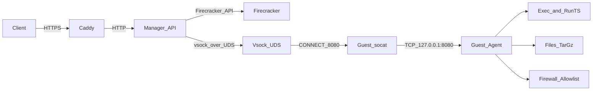

`run-dat-sheesh` is an **API-only Firecracker microVM sandbox runner**.

It runs untrusted code **inside a Firecracker microVM**, with a host-side **manager API** (Fastify) that provisions microVMs and proxies requests to a guest-side **agent** (Fastify) over **vsock**.

## Architecture (high level)

## Quick links
- **Quickstart (Docker Hub)**: see [Quickstart](./quickstart.md)
- **Build guest image**: see [Guest image](./guest-image.md)
- **Environment variables**: see [Env vars](./env-vars.md)
- **API usage**: see [API](./api.md) (or open [Swagger](../swagger))

