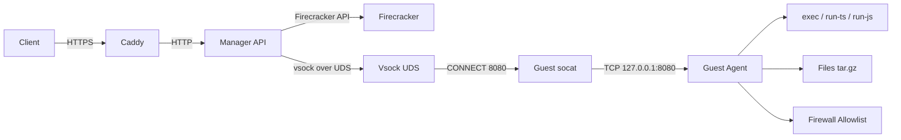

`run-dat-sheesh` is an **API-only Firecracker microVM sandbox runner**.

It runs untrusted code **inside a Firecracker microVM**, with a host-side **manager API** (Fastify) that provisions microVMs and proxies requests to a guest-side **agent** (Fastify) over **vsock**.

## Key Features

- **Near-instant VM provisioning** (~50-100ms) via OverlayFS copy-on-write storage
- **Minimal disk usage** - VMs share a read-only base image; only writes consume space
- **Secure isolation** - Firecracker microVM + chroot jail + per-VM firewall
- **Simple REST API** - Create VMs, execute code, transfer files
- **TypeScript/JavaScript execution** - Deno and Node.js support with structured results
- **Snapshots** - Save VM state for fast restore

## Architecture (high level)

## Quick links
- **Quickstart (Docker Hub)**: see [Quickstart](./quickstart.md)
- **Architecture & Storage**: see [Architecture](./architecture.md) for OverlayFS details and orchestration patterns
- **Build guest image**: see [Guest image](./guest-image.md)
- **Environment variables**: see [Env vars](./env-vars.md)
- **API usage**: see [API](./api.md) (or open [Swagger](../swagger))

